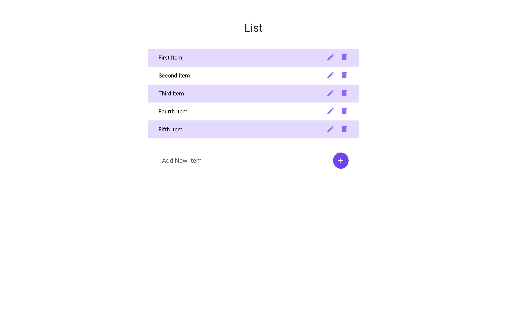

# React Bootcamp Project #10

### React - Color Boxes - State Patterns

## Description
This is a simple to-do list for working with React forms.

<!--  -->

## How to Launch the App
Download or clone this repo to your machine
- Install dependencies with `npm install` OR your favorite package manager's equivalent
- Run `npm start` in the root directory to start the server and launch the app

## Dependencies
- create-react-app
- Google Fonts - Roboto (400, 500)

## How to Use
Fork this respository, then clone it to your local machine. Run `npm start` in the root directory to start the server and launch the app

#### Fork this repository:
Click the Fork button in the top right

#### Clone the forked repository
**This is important because you won't be able to push your changes if you don't clone _your_ forked repository**
Clone _your_ forked repository to your desktop by navigating to the repository, clicking the "clone or download" button, and copying the link. Then, run `git clone <YOUR CLONED REPOSITORY>`
